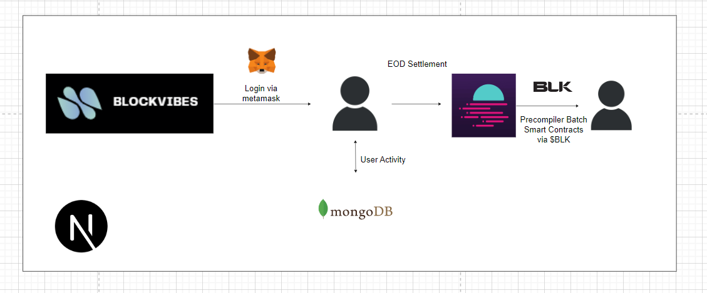

# EasyA x Polkadot_Hackathon

# What is BlockVibes?

It is a Decentralized social media application (DApp) that leverages Moonbeam to host user data. The user can log into the website using their metamask wallet address. They are immediately given reputation tokens which they spend by upvoting or commenting on their favourite posts. This allows us to monetize user content easily 

## Functionalities involved

1. Login through Metamask wallet
2. Token based reward system
3. Ability to post, comment, upvote and downvote
4. Community based interactions with like-minded people
5. Transparent incentive payout
6. Moonbeam sponsored batch smart-contracts

## Steps to replicate
1. Clone the repo
2. Run 'npm i' command in both client and server folders
3. Run 'node app.js' in a seperate terminal to run the back-end 
4. Run 'npm start' in client to run the front-end 

## Architecture diagram
